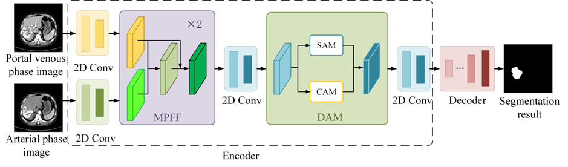

# MFDA: Automated Volumetric Assessment of Hepatocellu-lar Carcinomas Using Multi-Phase-Fused Dual-Attention Network 
This is the project web for the study titled "Automated Volumetric Assessment of Hepatocellu-lar Carcinomas Using Multi-Phase-Fused Dual-Attention Network".

<div align="center">
  
</div>

## Requirements
CUDA 10.0<br />
Python 3.6<br />
keras 2.2.5<br />
CuDNN v7

### Data Preparation
The folder structure of the dataset should be like

    dataset/train/
      ├── img_v
      ├── img_a
      ├── mask_v
            ├── 1.png
            ├── 2.png
            ├── ...

### Date Preprocessing

  Run the `png2npy.py` to merge images of the same modality into a single npy file.

### Pre-training

  To pre-train our MFDA, run `main.py`. The weights will be saved in `./result/da_add_av/cam_av/`. You can also use the pre-trained checkpoints of Edge-MAE in the `./result/da_add_av/cam_av/`. 


### Test

  Run `test.py`, and the segmented image will be saved in `./result/da_add_av/cam_av/CAM_pre/`, and can obtain the sen, spe, OR and UR values.

##  Citation
If this code is helpful for your study, please cite:
```bibtex

```

## 4. References
- 
